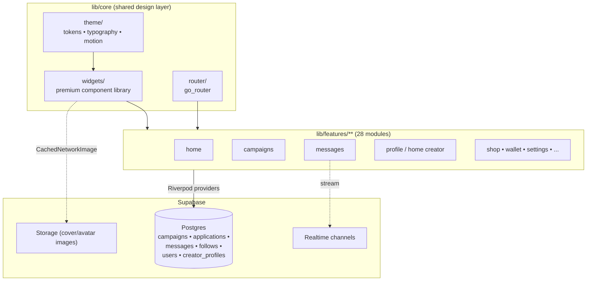
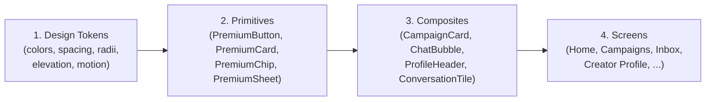
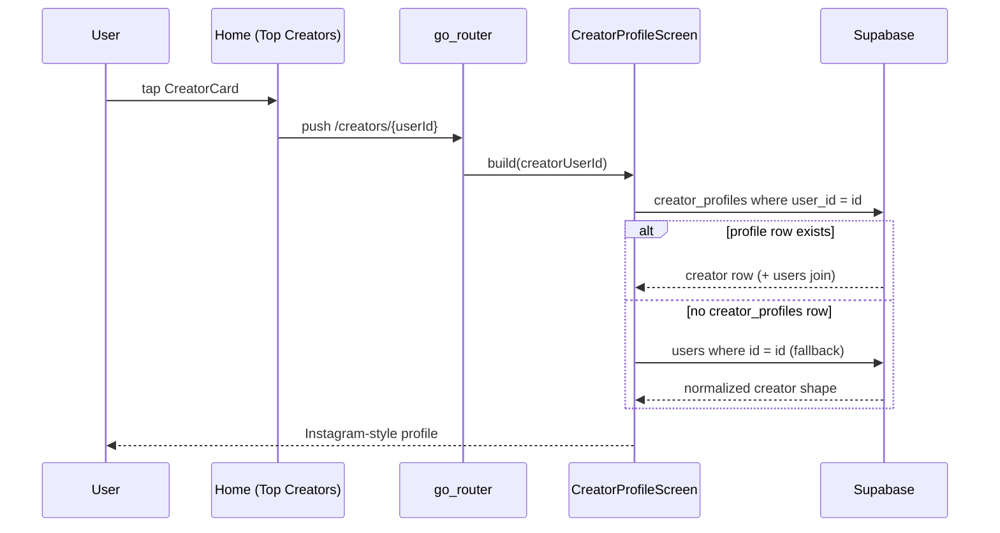
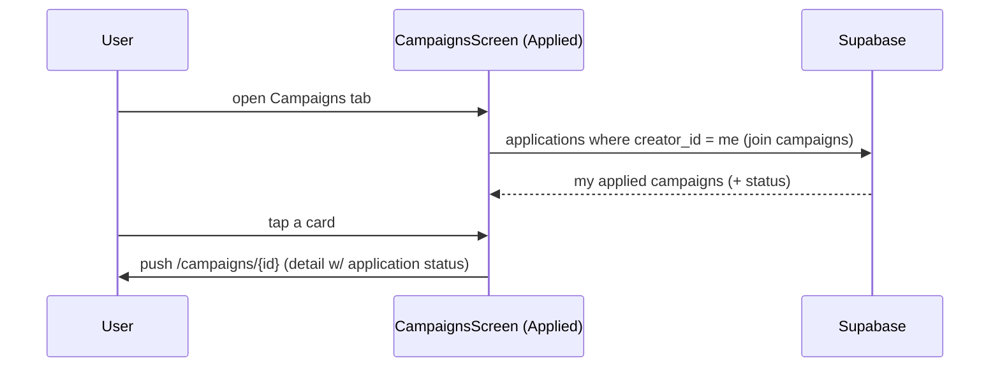
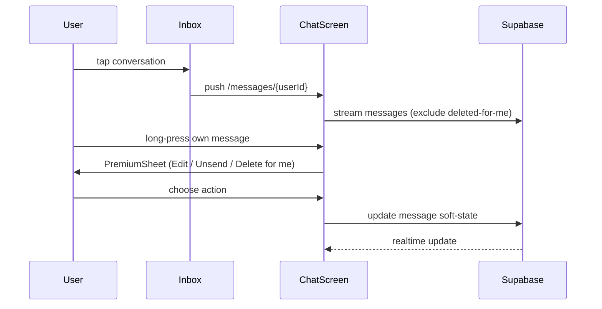
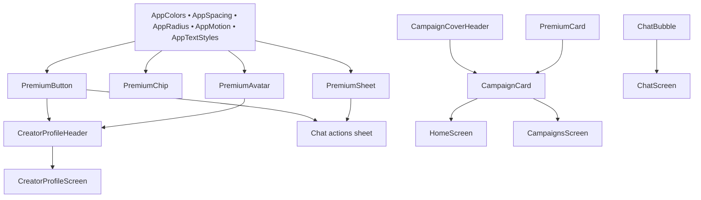

# Design Document: Premium UI/UX Redesign

## Overview

This design defines an app-wide premium UI/UX redesign of the **Rexo Marketplace** Flutter app (`rexo_marketplace`). It is a design-first spec covering **both** a High-Level Design (design system, component architecture, navigation, screen inventory) and a Low-Level Design (widget specifications in Dart, animation approach, data-model changes).

The redesign pursues five outcomes requested by the product owner:

1. **Compact premium campaign cards** on Home and Campaigns, with cover images rendering reliably in exactly three places (home card, campaign list card, campaign detail header).
2. **Applied-only Campaigns tab** — the Campaigns tab becomes the creator's "my applied campaigns" view.
3. **A proper premium messaging inbox** with unsend, delete-for-me, and edit.
4. **Instagram-style public creator profiles** reachable from Top Creators (fixing the current "creator not found" bug) with follow/unfollow, copy-profile-link, and message actions.
5. **A cohesive premium visual language across every screen** — consistent theme tokens, a premium icon pack (Iconsax, already a dependency), a custom button/component library (no stock Material look), smooth 60fps motion, and fast perceived loading via shimmer skeletons and image caching.

The design is deliberately grounded in the existing architecture: it **extends** the current `lib/core/theme` token system and `lib/core/widgets` shared components rather than replacing them, and reuses the libraries already in `pubspec.yaml` (`flutter_animate`, `iconsax_flutter`, `cached_network_image`, `shimmer`, `google_fonts`). No heavy new dependencies are introduced; one small optional helper is recommended where it adds clear value (see [Dependencies](#dependencies)).

Because the codebase is Flutter, **all code examples in this document use Dart**.

---

## Architecture

### System context

The app is a Riverpod + `go_router` client over a Supabase backend. The UI layer is organized by feature module under `lib/features/**` with a shared design layer under `lib/core/**`. This redesign changes the **presentation layer** (theme tokens, shared widgets, screen composition, motion) and introduces **additive** data-model changes (message soft-state columns, resilient creator lookup). It does not restructure state management or routing.



### Design layering strategy

The redesign is expressed as four concentric layers. Higher layers depend only on lower ones, which keeps the "premium look" centralized and consistent.



- **Layer 1 – Tokens** (`lib/core/theme/`): the single source of truth. Fixes the "inconsistent theme color" problem by removing ad-hoc `GoogleFonts.poppins(...)` and hard-coded colors scattered across screens.
- **Layer 2 – Primitives** (`lib/core/widgets/`): reusable, theme-driven building blocks with no business logic. Replaces raw `ElevatedButton`/`OutlinedButton`/`Chip`/`showModalBottomSheet`.
- **Layer 3 – Composites**: feature-level widgets built only from primitives + tokens.
- **Layer 4 – Screens**: composition + Riverpod wiring + motion.

### Guiding principles

- **Token-first**: no literal colors, font sizes, durations, or paddings in feature code — always reference a token.
- **Const-first**: every static subtree is a `const` widget to minimize rebuilds.
- **Provider-scoped rebuilds**: watch the narrowest provider/selector so a list item never rebuilds the whole screen.
- **Skeleton-before-spinner**: prefer shimmer skeletons that match final layout over centered `CircularProgressIndicator`.
- **Motion with intent**: entrance/transition animations are subtle (≤ 400ms), reuse shared curves/durations, and never block interaction.

---

## Design System

The design system extends the existing token files. New tokens live alongside the current ones so nothing breaks during incremental adoption.

### Color tokens

Retain the existing brand palette (`AppColors`), and add semantic surface/state tokens so both light and dark themes stay consistent. The brand primary remains the signature warm orange.

| Token | Light | Dark | Usage |
|---|---|---|---|
| `primary` | `#FF5722` | `#FF5722` | Primary actions, active nav, price/value emphasis |
| `primaryLight` | `#FF8A65` | `#FF8A65` | Gradient start, tints |
| `primaryDark` | `#E64A19` | `#E64A19` | Gradient end, pressed state |
| `secondary` | `#1A1A2E` | `#1A1A2E` | Deep ink accents |
| `background` | `#FAFAFA` | `#121212` | Scaffold |
| `surface` | `#FFFFFF` | `#1E1E1E` | Cards, sheets, app bars |
| `surfaceAlt` (new) | `#F3F4F6` | `#2C2C2C` | Input fills, chips, message-in bubble |
| `border` | `#E5E7EB` | `#3A3A3A` | 1px hairline borders |
| `success` / `warning` / `error` | `#4CAF50` / `#FFC107` / `#E53935` | same | Status |
| `textPrimary` / `textSecondary` / `textHint` | `#1A1A2E` / `#6B7280` / `#9CA3AF` | `#F5F5F5` / `#B0B0B0` / `#757575` | Text hierarchy |

**Motion accent gradients** reuse `AppColors.primaryGradient` (primary → primaryDark) for the send button, follow button, and CTA fills.

> Consistency rule: screens must consume colors via `Theme.of(context).colorScheme.*` or `AppColors.*` tokens only. The redesign removes standalone `Color(0xFF...)` literals from feature widgets (e.g. the role-badge colors currently hard-coded in `public_profile_screen.dart` move into a `RoleBadge` primitive).

### Typography scale

Keep Poppins via `google_fonts` and the existing `AppTextStyles` scale (h1–h6, bodyLarge/Medium/Small, caption, button, label*). The redesign standardizes usage:

- Screen titles → `AppTextStyles.h5` (18/w600)
- Card titles → `AppTextStyles.h6` / `labelLarge`
- Metadata & captions → `AppTextStyles.caption` (11) with `textSecondary`
- Never call `GoogleFonts.poppins(...)` inline in feature code — use `AppTextStyles` (which already omits color so it inherits theme contrast).

### Spacing scale (new token set)

Introduce an 8pt-based spacing scale to end arbitrary paddings.

```dart
abstract class AppSpacing {
  static const double xs = 4;
  static const double sm = 8;
  static const double md = 12;
  static const double lg = 16;
  static const double xl = 24;
  static const double xxl = 32;
}
```

### Radius & elevation tokens (new)

```dart
abstract class AppRadius {
  static const double sm = 8;    // chips, badges
  static const double md = 12;   // buttons, inputs
  static const double lg = 16;   // cards
  static const double xl = 24;   // bottom sheets
  static const double pill = 999;
}

abstract class AppElevation {
  // Soft shadow in light mode, lifted shadow in dark mode (mirrors PremiumCard).
  static List<BoxShadow> card(bool isDark) => [
        BoxShadow(
          color: Colors.black.withOpacity(isDark ? 0.30 : 0.04),
          offset: const Offset(0, 2),
          blurRadius: 8,
        ),
      ];
}
```

### Motion tokens (new)

Centralized durations and curves so every animation feels part of one system. Built to pair with `flutter_animate` (already a dependency).

```dart
abstract class AppMotion {
  static const Duration fast = Duration(milliseconds: 150);   // taps, toggles
  static const Duration base = Duration(milliseconds: 250);   // most transitions
  static const Duration slow = Duration(milliseconds: 400);   // page/hero

  static const Curve standard = Curves.easeOutCubic;          // enter
  static const Curve emphasized = Curves.easeInOutCubicEmphasized;
  static const Curve exit = Curves.easeInCubic;

  // Staggered list entrance: item i starts at i * stagger.
  static const Duration stagger = Duration(milliseconds: 40);
}
```

**Standard motion patterns:**

- **List entrance**: `fadeIn + slideY(begin: 0.08)` over `base`, staggered by `stagger` (via `flutter_animate`).
- **Tap feedback**: primitives scale to 0.97 over `fast` on press-down (`AnimatedScale`).
- **Page transitions**: shared-axis / fade-through on pushed routes (see [Navigation](#navigation-flows)).
- **Skeleton → content**: cross-fade over `base` when a provider resolves.

### Premium component library (Layer 2 primitives)

All primitives live in `lib/core/widgets/` and are theme-driven. This is the "custom button component library" that replaces the stock Material look.

| Primitive | Replaces | Notes |
|---|---|---|
| `PremiumButton` | `ElevatedButton` / `OutlinedButton` / `TextButton` | Variants: `filled`, `tonal`, `outline`, `ghost`; gradient option; leading Iconsax icon; loading state; press-scale animation |
| `PremiumCard` (exists) | raw `Container` cards | Already token-driven; keep, add `onTap` press-scale |
| `PremiumChip` | `Chip` / ad-hoc filter chips | Selected/unselected, count badge, Iconsax leading icon |
| `PremiumSheet` | raw `showModalBottomSheet` bodies | Grab handle, title row, `xl` top radius, safe-area, drag-to-dismiss |
| `PremiumIconButton` | `IconButton` | 44×44 tap target, Iconsax, optional tonal background |
| `PremiumTextField` | ad-hoc `TextField` | Uses `inputDecorationTheme`; search + multiline variants |
| `PremiumAvatar` | `CircleAvatar` + `AvatarWidget` | Consolidates avatar rendering; ring/verified overlay; `cached_network_image` |
| `SectionHeader` | inline title rows | "Title + optional action" row with consistent spacing |
| `EmptyState` | ad-hoc empty columns | Iconsax glyph + title + subtitle + optional CTA |
| `RoleBadge` / `StatPill` | inline badges/stat rows | Pull hard-coded colors into tokens |

> Icons: standardize on **`iconsax_flutter`** everywhere. Remaining raw `Icons.*` usages (e.g. `Icons.close`, `Icons.add` in campaigns/messages screens) are replaced with Iconsax equivalents (`Iconsax.close_circle`, `Iconsax.add`) so no default Material glyphs remain.

---

## Navigation Flows

Navigation remains `go_router` with the existing `StatefulShellRoute.indexedStack` (Home / Campaigns / Shop / Messages / Profile). The redesign refines transitions and clarifies three flows.

### Bottom navigation

`AppBottomNav` is restyled as a premium floating bar: rounded top corners, blurred/opaque surface, Iconsax duotone active state, animated indicator, and a subtle scale on the active item. Branch state preservation (indexed stack) is retained so tab switches are instant.

### Page transition strategy

Pushed (non-shell) routes adopt a consistent transition via a small `CustomTransitionPage` helper:

- **Detail pushes** (campaign detail, creator profile, chat): shared-axis horizontal (`slideX + fadeThrough`) over `AppMotion.base`.
- **Modal-ish pushes** (create campaign, apply): slide-up.
- Tab switches: no transition (indexed stack), preserving scroll position.

### Flow 1 — Home → Creator profile (bug fix)



### Flow 2 — Campaigns tab = applied campaigns



### Flow 3 — Inbox → Chat with message actions



---

## Screen Inventory (screen-by-screen redesign)

Every user-facing screen adopts the design system. The table sets the scope; screens with specific behavioral changes are detailed in later sections.

| # | Screen | Module | Key redesign actions |
|---|---|---|---|
| 1 | Splash | auth | Animated logo (scale+fade via flutter_animate), brand gradient backdrop |
| 2 | Login / Register / MFA | auth | `PremiumTextField`, `PremiumButton` filled, inline validation, keyboard-safe layout |
| 3 | Home | home | Restyled greeting header, segmented Campaigns/Creators toggle as `PremiumChip`s, compact `CampaignCard`, staggered entrance, shimmer skeletons |
| 4 | Campaigns (**Applied**) | campaigns | Repurposed to applied-only list; status chips (pending/approved/rejected); compact `CampaignListCard`; empty state CTA "Browse campaigns" |
| 5 | Campaign detail | campaigns | Cover header (3rd cover location), sticky premium CTA, sections via `SectionHeader`, application-status banner |
| 6 | Apply | campaigns | Multi-field form with `PremiumTextField`, progress affordance, `PremiumButton` submit |
| 7 | Create / My campaigns / Applicants | campaigns | Token cleanup, `PremiumButton` FABs, applicant cards use `PremiumAvatar` |
| 8 | Inbox (Messages) | messages | Full premium messaging list; unread badge; swipe actions; `PremiumAvatar`; online-ish presence-ready layout |
| 9 | Chat | messages | Premium bubbles; edit/unsend/delete-for-me; edited/"message unsent" states; date separators; grouped bubbles |
| 10 | Creator public profile | home/profile | Instagram-style header (avatar, stats row, bio, actions), follow/unfollow, copy link, message |
| 11 | My profile / Edit profile | profile | Instagram-style consistency with public profile; `PremiumButton`s |
| 12 | Shop / Product / Cart / Checkout | shop | `PremiumCard` product cards, cached images, compact layout, premium CTAs |
| 13 | Wallet / Deposit / Withdraw | wallet | Balance hero card w/ gradient, transaction rows, premium buttons |
| 14 | Notifications | notifications | Grouped list, Iconsax type glyphs, unread highlight |
| 15 | Settings & sub-pages | settings | Grouped `SectionHeader` lists, `PremiumIconButton` rows |
| 16 | Seller profile / Services / Subscriptions / Orders / Disputes / Reviews / Coupons / Wallet security etc. | various | Token + primitive adoption, shimmer skeletons, empty states, consistent app bars |
| 17 | Admin shell | admin | Token adoption only (out of primary scope, kept visually consistent) |

**Global screen-level conventions** applied everywhere:

- App bars: `surface` background, `elevation: 0`, `scrolledUnderElevation: 0.5`, Iconsax back button, `AppTextStyles.h5` title.
- Lists: shimmer skeleton matching final row shape while loading; `EmptyState` when empty; sanitized error via existing `ErrorUtils`.
- Content padding: `AppSpacing.lg` horizontal.
- Entrance: first paint of list items animates with the standard staggered pattern.

---

## Components and Interfaces

This section specifies the key primitives and composites (Dart signatures + responsibilities). Full method bodies for algorithm-heavy pieces appear in [Key Functions](#key-functions-with-formal-specifications) and [Algorithmic Pseudocode](#algorithmic-pseudocode).

### PremiumButton (primitive)

```dart
enum PremiumButtonVariant { filled, tonal, outline, ghost }

class PremiumButton extends StatefulWidget {
  final String label;
  final VoidCallback? onPressed;      // null => disabled
  final PremiumButtonVariant variant;
  final IconData? icon;               // Iconsax leading icon
  final bool loading;                 // shows spinner, blocks taps
  final bool gradient;                // filled variant: use primaryGradient
  final bool expand;                  // full-width (default true)

  const PremiumButton({
    super.key,
    required this.label,
    required this.onPressed,
    this.variant = PremiumButtonVariant.filled,
    this.icon,
    this.loading = false,
    this.gradient = false,
    this.expand = true,
  });
}
```

**Responsibilities:** render token-driven button; animate press-scale (0.97) over `AppMotion.fast`; show spinner and ignore taps when `loading`; disabled styling when `onPressed == null`.

### PremiumChip (primitive)

```dart
class PremiumChip extends StatelessWidget {
  final String label;
  final bool selected;
  final IconData? icon;
  final int? count;              // optional trailing count badge
  final VoidCallback? onTap;
  const PremiumChip({ super.key, required this.label, this.selected = false,
    this.icon, this.count, this.onTap });
}
```

### PremiumSheet (primitive)

```dart
// Helper that standardizes modal bottom sheets.
Future<T?> showPremiumSheet<T>({
  required BuildContext context,
  required String title,
  required Widget child,
  bool isScrollControlled = true,
});
```

**Responsibilities:** grab handle, title row with close `PremiumIconButton`, `AppRadius.xl` top corners, `surface` background, safe-area, scroll-controlled height.

### CampaignCard (composite — redesigned, compact)

```dart
class CampaignCard extends StatelessWidget {
  final Map<String, dynamic> campaign;
  final VoidCallback? onTap;
  final CampaignCardLayout layout;   // horizontal (home carousel) | compact (list)
  const CampaignCard({ super.key, required this.campaign, this.onTap,
    this.layout = CampaignCardLayout.compact });
}

enum CampaignCardLayout { horizontal, compact }
```

**Responsibilities:** one shared card used by Home and Campaigns (replaces the two divergent `CampaignCard` + `CampaignListCard`). Renders `CampaignCoverHeader` (cover location #1/#2), title, brand, budget/payout, slots, deadline — in a **compact** footprint (see [sizing spec](#compact-campaign-card-sizing-spec)).

### CampaignCoverHeader (existing — reused unchanged in behavior)

```dart
class CampaignCoverHeader extends StatelessWidget {
  final String coverImageUrl;
  final double height;
  final List<Widget> overlay;
}
```

The cover image is rendered here in all three locations. See [cover-image fix](#cover-image-rendering-fix).

### ChatBubble (composite — redesigned)

```dart
class ChatBubble extends StatelessWidget {
  final MessageView message;         // typed view model (see Data Models)
  final bool isMine;
  final bool showTail;               // last in a same-sender group
  final VoidCallback? onLongPress;   // opens actions sheet (own, non-deleted)
  const ChatBubble({ super.key, required this.message, required this.isMine,
    this.showTail = true, this.onLongPress });
}
```

**Responsibilities:** premium bubble; renders normal / edited (shows "edited") / unsent ("🚫 message unsent", italic, no actions); time + read tick for mine.

### CreatorProfileHeader (composite — Instagram-style)

```dart
class CreatorProfileHeader extends StatelessWidget {
  final CreatorView creator;
  final bool isFollowing;
  final int followerCount;
  final VoidCallback onToggleFollow;
  final VoidCallback onMessage;
  final VoidCallback onCopyLink;
}
```

**Responsibilities:** avatar + name/handle/verified, horizontal stats row (Followers · Campaigns · Rating), bio, and an action row (`Follow/Following` `PremiumButton`, `Message` outline, `Copy link` `PremiumIconButton`).

### Component/interface relationships




---

## Data Models

The redesign is mostly presentational, but three data concerns require model changes: **message soft-state** (edit/unsend/delete-for-me), the **applied-campaigns** query, and **resilient creator lookup**. Changes are additive and backward compatible.

### Message model (extended)

The current `messages` table has `sender_id, receiver_id, content, is_read, created_at`. Add soft-state columns so unsend/edit/delete-for-me are non-destructive and auditable.

```dart
/// Typed view model used by the UI (parsed from the messages row).
class MessageView {
  final String id;
  final String senderId;
  final String receiverId;
  final String content;         // display content (may be "" when unsent)
  final bool isRead;
  final DateTime createdAt;

  // New soft-state fields:
  final bool isUnsent;          // unsent by sender -> hidden content for everyone
  final DateTime? editedAt;     // non-null => show "edited"
  final List<String> deletedFor; // user ids who deleted-for-me (client filters)
}
```

**New columns on `messages`:**

| Column | Type | Default | Meaning |
|---|---|---|---|
| `is_unsent` | `boolean` | `false` | Sender unsent the message; content hidden for all participants |
| `edited_at` | `timestamptz` | `null` | Last edit time; presence => show "edited" label |
| `deleted_for` | `uuid[]` | `'{}'` | User ids who deleted-for-me; excluded per-user in queries/UI |

**Validation / invariants:**

- Only the **sender** may `edit` or `unsend`; enforced in RLS and provider.
- `edit` is disallowed once `is_unsent = true`.
- `delete-for-me` only appends the current user's id to `deleted_for` (never removes content for others).
- A message is visible to user `u` iff `u ∉ deleted_for`.
- Displayed body = `is_unsent ? "" : content`; unsent bubbles render the "message unsent" placeholder and expose no actions.

### Applied-campaigns query model

No schema change. The Campaigns tab switches its data source from "all active campaigns" (`campaignsListProvider`) to the current user's applications joined with campaign rows. A dedicated provider returns campaign maps augmented with `application_status`.

```dart
/// Campaign rows the current user has applied to, newest application first.
/// Each map is the campaign object plus 'application_status' and 'applied_at'.
final appliedCampaignsProvider =
    FutureProvider.autoDispose<List<Map<String, dynamic>>>((ref) async { ... });
```

Underlying query (conceptually):

```sql
select a.status as application_status, a.created_at as applied_at,
       c.*, u.name as brand_name, u.avatar_url as brand_avatar
from applications a
join campaigns c on c.id = a.campaign_id
left join users u on u.id = c.brand_id
where a.creator_id = :me
order by a.created_at desc;
```

### Creator lookup model (resilient)

`creator_profiles` is optional per user. The redesign guarantees a non-null result for any valid creator `user_id` by falling back to the `users` row.

```dart
/// Normalized creator shape consumed by CreatorProfileHeader.
class CreatorView {
  final String userId;
  final String name;
  final String? avatarUrl;
  final String handle;
  final bool isVerified;
  final String category;    // '' when no creator_profiles row
  final String bio;         // '' when none
  final double rating;      // 0.0 when none
  final int campaignsCompleted; // 0 when none

  static CreatorView fromCreatorProfileRow(Map<String, dynamic> row);
  static CreatorView fromUserRow(Map<String, dynamic> user);
}
```

### Follow model (existing, reused)

`follows(follower_id, following_id)` with a unique pair. Existing `followActionsProvider`, `isFollowingProvider`, `followerCountProvider` are reused; the redesign adds optimistic UI (toggle immediately, reconcile on completion).

---

## Bug Fixes (designed remediations)

### Cover-image rendering fix

**Symptom:** cover images sometimes don't render on cards.

**Root cause (design analysis):** `CampaignCoverHeader` renders correctly **when** `campaign['cover_image_url']` is present, but several campaign providers do **not select all columns / consistent columns**. In particular, `home_provider.dart`'s `featuredCampaignsProvider`, `filteredCampaignsProvider`, and `recentCampaignsProvider` use `.select()` (all columns — OK), while some list paths and the compact home path rely on the map having `cover_image_url`. The fix standardizes every campaign query to explicitly include `cover_image_url` and guarantees the three render sites pass it through:

1. **Home card** (`CampaignCard`) — cover location #1.
2. **Campaign list card** (Campaigns tab) — cover location #2.
3. **Campaign detail header** — cover location #3 (currently the detail screen must render `CampaignCoverHeader` with the campaign's `cover_image_url`; the redesign makes this the hero header).

**Remediation:**
- Add `cover_image_url` to all campaign `select(...)` projections used by cards/detail.
- Keep `CachedNetworkImage` (already used) for caching + placeholder + error fallback (gradient). This also improves perceived performance.
- Ensure the detail screen uses `CampaignCoverHeader` as its top hero (the 3rd and only other cover location).

### "Creator not found" fix

**Root cause (confirmed in code):** Top Creators navigates to `/creators/{user_id}`. `creatorProfileProvider` queries `creator_profiles` filtered by `user_id` with `.maybeSingle()`. When a creator exists only as a `users` row with `role = 'creator'` (exactly the `trendingCreatorsProvider` fallback path), there is **no `creator_profiles` row**, so the provider returns `null` and the screen shows "Creator not found."

**Remediation:** make `creatorProfileProvider` resilient — when `creator_profiles` yields null, fall back to the `users` row and normalize into `CreatorView`. See [`resolveCreator`](#function-resolvecreator).

### Campaign card "too big" fix

Replace the two oversized cards with one compact `CampaignCard`. See [sizing spec](#compact-campaign-card-sizing-spec).

---

## Low-Level Design (Code-First)

### Compact campaign card sizing spec

Current cards are tall: cover 140 + generous padding + description + two info chips + slots. The compact redesign:

- **Cover height**: `96` (compact list) / `120` (home horizontal), down from 140.
- **Padding**: `AppSpacing.md` (12) instead of ad-hoc.
- **Overlay budget**: removed from the giant centered overlay; budget shown inline as a compact value pill in the content row (keeps price emphasis without a huge hero number).
- **Description**: single line max on list card (was 2), omitted on home card.
- **Slots**: thin 4px progress bar + `filled/total` caption (retained, compact).
- **Total target height**: ≈ `188` compact / ≈ `210` horizontal (was ~260–300).

```dart
// Compact list layout (Campaigns "applied" tab + home vertical list)
PremiumCard(
  onTap: onTap,
  padding: EdgeInsets.zero,
  child: Column(
    mainAxisSize: MainAxisSize.min,
    crossAxisAlignment: CrossAxisAlignment.start,
    children: [
      CampaignCoverHeader(
        coverImageUrl: coverUrl,
        height: 96,
        overlay: [
          if (platform.isNotEmpty)
            Positioned(top: 8, right: 8,
              child: OverlayBadge.onMedia(icon: platformIcon, label: platform)),
          if (applicationStatus != null)
            Positioned(top: 8, left: 8,
              child: StatusChip(status: applicationStatus)), // applied tab only
        ],
      ),
      Padding(
        padding: const EdgeInsets.all(AppSpacing.md),
        child: Column(
          crossAxisAlignment: CrossAxisAlignment.start,
          children: [
            Text(title, style: AppTextStyles.labelLarge, maxLines: 1,
                 overflow: TextOverflow.ellipsis),
            const SizedBox(height: AppSpacing.xs),
            Row(children: [
              _ValuePill(icon: Iconsax.wallet_2, value: budgetText),   // compact
              const SizedBox(width: AppSpacing.sm),
              const Spacer(),
              _SlotsMini(filled: filled, total: total),                // 4px bar
            ]),
          ],
        ),
      ),
    ],
  ),
)
```

### Core view models / types

```dart
// Message soft-state actions surfaced in the chat actions sheet.
enum MessageAction { edit, unsend, deleteForMe, copy }

// Application lifecycle used by the applied-campaigns status chip.
enum ApplicationStatus { pending, approved, rejected, unknown }

extension ApplicationStatusX on ApplicationStatus {
  Color color(BuildContext c);   // pending->warning, approved->success, rejected->error
  String get label;              // 'Pending' | 'Approved' | 'Rejected'
}
```

### Provider surface (Riverpod)

```dart
// Messages
final chatMessagesStreamProvider =            // EXISTS (extended: parse MessageView, filter deletedFor)
    StreamProvider.autoDispose.family<List<MessageView>, String>(...);
final messageActionsProvider =                // EXTENDED: editMessage / unsendMessage / deleteForMe
    StateNotifierProvider<MessageActionsNotifier, AsyncValue<void>>(...);

// Campaigns
final appliedCampaignsProvider =              // NEW: applied-only list
    FutureProvider.autoDispose<List<Map<String, dynamic>>>(...);

// Creators
final creatorProfileProvider =                // EXTENDED: resilient (CreatorView, users fallback)
    FutureProvider.family<CreatorView?, String>(...);
```

---

## Key Functions with Formal Specifications

### function: resolveCreator

```dart
Future<CreatorView?> resolveCreator(String creatorUserId);
```

**Preconditions:**
- `creatorUserId` is a non-empty string that may or may not have a `creator_profiles` row.

**Postconditions:**
- Returns a `CreatorView` when a `creator_profiles` row **or** a `users` row exists for the id.
- Returns `null` only when **no** `users` row exists for the id (genuinely unknown user).
- Never throws for the "profile-missing-but-user-exists" case (the current bug).
- No writes/side effects.

**Loop invariants:** N/A (no loops).

### function: visibleMessages

```dart
List<MessageView> visibleMessages(List<MessageView> all, String currentUserId);
```

**Preconditions:**
- `all` is chronologically sortable; `currentUserId` is the signed-in user.

**Postconditions:**
- Returns messages where `currentUserId ∉ m.deletedFor`, preserving ascending `createdAt` order.
- Unsent messages remain in the result (rendered as placeholder) unless also deleted-for-me.
- Pure function (no mutation of `all`).

**Loop invariants:**
- After processing index `i`, the output contains exactly the not-deleted-for-me messages among `all[0..i]`, in original order.

### function: editMessage

```dart
Future<bool> editMessage({ required String messageId, required String newContent });
```

**Preconditions:**
- Caller is the message sender; `newContent` is non-empty after trim; target message has `is_unsent == false`.

**Postconditions:**
- On success: `content = newContent`, `edited_at = now()`; returns `true`.
- On precondition violation or RLS denial: no change; returns `false`.
- Idempotent for identical `newContent` (edited_at still refreshed).

**Loop invariants:** N/A.

### function: unsendMessage

```dart
Future<bool> unsendMessage(String messageId);
```

**Preconditions:** caller is the sender.

**Postconditions:** on success `is_unsent = true` and displayed content becomes empty for all participants; returns `true`. Unsend is terminal (cannot be edited afterward).

### function: deleteForMe

```dart
Future<bool> deleteForMe(String messageId);
```

**Preconditions:** caller is a participant (sender or receiver).

**Postconditions:** appends caller id to `deleted_for` (set semantics — no duplicates); message becomes invisible to caller only; other participant unaffected; returns `true`.

---

## Algorithmic Pseudocode

### Resilient creator resolution

```pascal
ALGORITHM resolveCreator(creatorUserId)
INPUT: creatorUserId : String
OUTPUT: CreatorView or null

BEGIN
  ASSERT creatorUserId <> ""

  // Primary: creator_profiles joined with users
  profileRow <- db.creator_profiles
                  .select("*, users!inner(id,name,avatar_url,handle,is_verified)")
                  .where(user_id = creatorUserId)
                  .maybeSingle()

  IF profileRow <> null THEN
    RETURN CreatorView.fromCreatorProfileRow(profileRow)
  END IF

  // Fallback: plain users row (fixes "creator not found")
  userRow <- db.users
               .select("id,name,avatar_url,handle,is_verified,bio")
               .where(id = creatorUserId)
               .maybeSingle()

  IF userRow <> null THEN
    RETURN CreatorView.fromUserRow(userRow)
  END IF

  RETURN null   // genuinely unknown user
END
```

### Visible-message filtering

```pascal
ALGORITHM visibleMessages(all, currentUserId)
INPUT: all : List<MessageView> (ascending by createdAt)
       currentUserId : String
OUTPUT: List<MessageView>

BEGIN
  result <- empty list
  FOR each m IN all DO
    // Invariant: result holds all not-deleted-for-me messages seen so far, in order
    IF currentUserId NOT IN m.deletedFor THEN
      result.append(m)
    END IF
  END FOR
  RETURN result
END
```

### Chat message action dispatch (long-press sheet)

```pascal
ALGORITHM onMessageAction(m, action, currentUserId)
INPUT: m : MessageView, action : MessageAction, currentUserId : String
OUTPUT: success : boolean

BEGIN
  isMine <- (m.senderId = currentUserId)

  MATCH action WITH
    | copy         -> copyToClipboard(m.content); RETURN true
    | deleteForMe  -> RETURN deleteForMe(m.id)              // any participant
    | edit         ->
        IF NOT isMine OR m.isUnsent THEN RETURN false END IF
        newText <- promptEditSheet(initial = m.content)
        IF newText = null OR trim(newText) = "" THEN RETURN false END IF
        RETURN editMessage(messageId = m.id, newContent = newText)
    | unsend       ->
        IF NOT isMine THEN RETURN false END IF
        RETURN unsendMessage(m.id)
  END MATCH
END
```

### Optimistic follow toggle

```pascal
ALGORITHM toggleFollow(creatorUserId, currentlyFollowing)
BEGIN
  // Optimistic UI: flip state immediately, reconcile on result
  setLocalFollowing(NOT currentlyFollowing)
  ok <- currentlyFollowing ? unfollow(creatorUserId) : follow(creatorUserId)
  IF NOT ok THEN
    setLocalFollowing(currentlyFollowing)   // revert on failure
    showToast("Couldn't update follow. Try again.")
  END IF
  invalidate(followerCountProvider(creatorUserId))
END
```

---

## Example Usage

```dart
// 1. Premium filled gradient CTA with loading state
PremiumButton(
  label: 'Apply now',
  icon: Iconsax.send_2,
  gradient: true,
  loading: applyState.isLoading,
  onPressed: applyState.isLoading ? null : () => _submit(),
);

// 2. Compact campaign card on the Applied tab
CampaignCard(
  campaign: applied[index],                 // includes application_status
  layout: CampaignCardLayout.compact,
  onTap: () => context.push('/campaigns/${applied[index]['id']}'),
);

// 3. Chat bubble with long-press actions
ChatBubble(
  message: msg,
  isMine: msg.senderId == myId,
  onLongPress: () => showPremiumSheet(
    context: context,
    title: 'Message',
    child: MessageActionsList(message: msg, isMine: msg.senderId == myId),
  ),
);

// 4. Instagram-style creator profile actions
CreatorProfileHeader(
  creator: creator,
  isFollowing: isFollowing,
  followerCount: followers,
  onToggleFollow: () => ref.read(followActionsProvider.notifier)
      .toggle(creator.userId, isFollowing),
  onMessage: () => context.push('/messages/${creator.userId}'),
  onCopyLink: () => copyProfileLink(creator.handle),  // e.g. rexo://profile/@handle
);

// 5. Staggered list entrance via flutter_animate
ListView.builder(
  itemBuilder: (c, i) => CampaignCard(campaign: items[i])
      .animate()
      .fadeIn(duration: AppMotion.base)
      .slideY(begin: 0.08, curve: AppMotion.standard, delay: AppMotion.stagger * i),
);
```

---

## Correctness Properties

Universal statements the implementation must satisfy (candidates for property-based and example tests):

### Property 1: Cover-image locations
∀ campaign `c` with non-empty `c.cover_image_url`, the image renders in exactly the home card, the list card, and the detail header — and nowhere else. When `cover_image_url` is empty, all three fall back to the brand gradient.

### Property 2: Creator resolution totality
∀ `id` such that a `users` row exists, `resolveCreator(id) ≠ null`. `resolveCreator(id) = null` ⟹ no `users` row exists for `id`.

### Property 3: Applied-only visibility
∀ campaign `c` shown on the Campaigns tab, ∃ an `applications` row with `creator_id = currentUser ∧ campaign_id = c.id`. Conversely, a campaign the user has not applied to never appears there.

### Property 4: Delete-for-me isolation
After `deleteForMe(m)` by user `u`, `m ∉ visibleMessages(_, u)` and `m ∈ visibleMessages(_, other)` for the other participant.

### Property 5: Unsend terminality
After `unsendMessage(m)`, displayed content is empty for both participants and `editMessage(m, _)` returns `false`.

### Property 6: Edit authorization
`editMessage`/`unsendMessage` succeed only when the caller is `m.senderId`; otherwise return `false` with no state change.

### Property 7: Follow toggle convergence
After a successful `toggleFollow`, `isFollowing` and `followerCount` reflect the new state; after a failed toggle, both revert to the pre-toggle values.

### Property 8: Visible-message order & filtering
`visibleMessages` is order-preserving and returns exactly the messages not deleted-for-me by the current user (idempotent, pure).

### Property 9: Compact card height
The compact `CampaignCard` renders at ≤ 210px tall for representative data (no overflow assertions in tests).

### Property 10: Token consistency
No feature widget references a raw color literal or inline `GoogleFonts.poppins(...)`; all come from tokens/`AppTextStyles` (lint/static-check property).

---

## Error Handling

### Scenario: cover image fails to load
**Condition:** network error or broken URL. **Response:** `CachedNetworkImage.errorWidget` shows the brand gradient fallback (existing behavior in `CampaignCoverHeader`). **Recovery:** cache retries on next build; no user action needed.

### Scenario: creator id has no profile and no user
**Condition:** `resolveCreator` returns `null`. **Response:** show `EmptyState` ("Creator unavailable") — reserved for genuinely missing users, not the old false-negative. **Recovery:** back navigation.

### Scenario: message action denied (not sender / RLS)
**Condition:** edit/unsend by non-sender. **Response:** action fails silently in provider (`false`), UI shows a snackbar "Only the sender can do that." **Recovery:** sheet closes; message unchanged.

### Scenario: optimistic follow fails
**Condition:** network/RLS failure after optimistic flip. **Response:** revert local state, snackbar. **Recovery:** user may retry.

### Scenario: applied-campaigns query fails
**Condition:** provider error. **Response:** sanitized error via `ErrorUtils.sanitize` + Retry `PremiumButton` (matches existing pattern). **Recovery:** invalidate provider.

### Scenario: realtime disconnect in chat
**Condition:** channel drops. **Response:** fall back to the existing periodic refetch on resume; show messages from last snapshot. **Recovery:** auto-resubscribe on reconnect.

---

## Testing Strategy

### Unit testing
- View-model parsing: `MessageView`, `CreatorView.fromUserRow`/`fromCreatorProfileRow`, `ApplicationStatus` mapping.
- Pure functions: `visibleMessages`, budget/deadline/count formatters, `onMessageAction` authorization branches (mock providers).

### Widget testing
- `CampaignCard` compact renders within height budget for min/typical/max data; cover fallback when url empty.
- `ChatBubble` states: normal, edited ("edited" label), unsent (placeholder, no long-press actions), mine vs theirs.
- `CreatorProfileHeader`: follow/following swap, copy-link invokes clipboard, message routes.
- `PremiumButton`: disabled when `onPressed == null`; spinner + tap-blocked when `loading`.

### Property-based testing
**Library:** no Dart-native property library is in `pubspec.yaml`; add `glados` (dev-only) for generative tests, or implement table-driven generators with `flutter_test` if avoiding new deps.

Properties to encode: #2 (creator totality), #4 (delete isolation), #5 (unsend terminality), #7 (follow convergence), #8 (visibleMessages order/filter/idempotence).

### Integration testing
- Home → tap creator (with and without `creator_profiles` row) → profile renders (regression for the bug).
- Apply to campaign → appears on Campaigns tab with `pending` status; unapplied campaign never appears.
- Chat: send → edit → shows "edited"; unsend → placeholder both sides; delete-for-me → hidden only for actor.

### Golden / visual testing (optional)
Golden tests for `CampaignCard`, `ChatBubble`, and `CreatorProfileHeader` in light + dark to lock the premium look and catch token regressions.

---

## Performance Considerations

- **Image caching**: `cached_network_image` for every cover/avatar (memory + disk cache); set `memCacheWidth`/`memCacheHeight` to decode at display size and cut memory.
- **Const & selectors**: mark static subtrees `const`; use Riverpod `select` so a list item rebuild never rebuilds the screen; `autoDispose` on screen-scoped providers.
- **Lazy lists**: `ListView.builder` / `SliverList` everywhere (already used); avoid building offscreen items. Replace `Wrap`-of-all-creators on Home with a lazy grid (`SliverGrid`) for large sets.
- **Skeletons over spinners**: shimmer skeletons matched to final layout reduce perceived latency and layout shift.
- **60fps motion**: animations use transform/opacity only (no layout thrash); durations ≤ `AppMotion.slow`; staggered entrance capped (e.g. first ~12 items) to avoid long cascades.
- **Query slimming**: select only needed columns (but always include `cover_image_url`); paginate long lists (existing `.limit(...)` retained).
- **Chat efficiency**: parse to `MessageView` once; realtime filter already scoped to the current user's rows; group consecutive same-sender bubbles to reduce widget count.

---

## Security Considerations

- **RLS for message soft-state**: `edit`/`unsend` allowed only when `auth.uid() = sender_id`; `deleted_for` updates allowed only for participants and may only append the caller's own id. Do not rely on client checks alone.
- **Delete-for-me is per-user**: never deletes the row or the other party's view; content remains for the counterparty.
- **Follow integrity**: unique `(follower_id, following_id)`; server rejects duplicates (existing re-entry guard remains client-side UX only).
- **Copy profile link**: links use a safe scheme/handle (`rexo://profile/@handle` or an https deep link) and never leak internal user ids.
- **No secrets in client**: image/URL rendering uses public Supabase Storage URLs; no service keys in the app.

---

## Dependencies

**Reused (already in `pubspec.yaml`), no new adds required for the core redesign:**
- `flutter_animate` — entrance/transition animations and staggering.
- `iconsax_flutter` — premium icon pack (standardized across all screens).
- `cached_network_image` — cover/avatar caching + placeholder/error fallback.
- `shimmer` — loading skeletons.
- `google_fonts` — Poppins via `AppTextStyles` (no inline usage in features).
- `flutter_riverpod`, `go_router`, `supabase_flutter`, `intl` — unchanged.

**Recommended optional (dev-only), add only if adopted:**
- `glados` (dev dependency) — Dart property-based testing for the correctness properties above. Optional; can be replaced with table-driven `flutter_test` generators to avoid a new dependency.

**Backend (Supabase) changes:**
- `messages`: add `is_unsent boolean default false`, `edited_at timestamptz`, `deleted_for uuid[] default '{}'`, plus RLS policies described in [Security](#security-considerations).
- No new tables; `applications`, `follows`, `creator_profiles`, `users` are reused as-is.

**Explicitly avoided:** heavy UI kits or alternative navigation/state libraries — the premium look is achieved with the existing stack to keep the app lightweight and fast.
